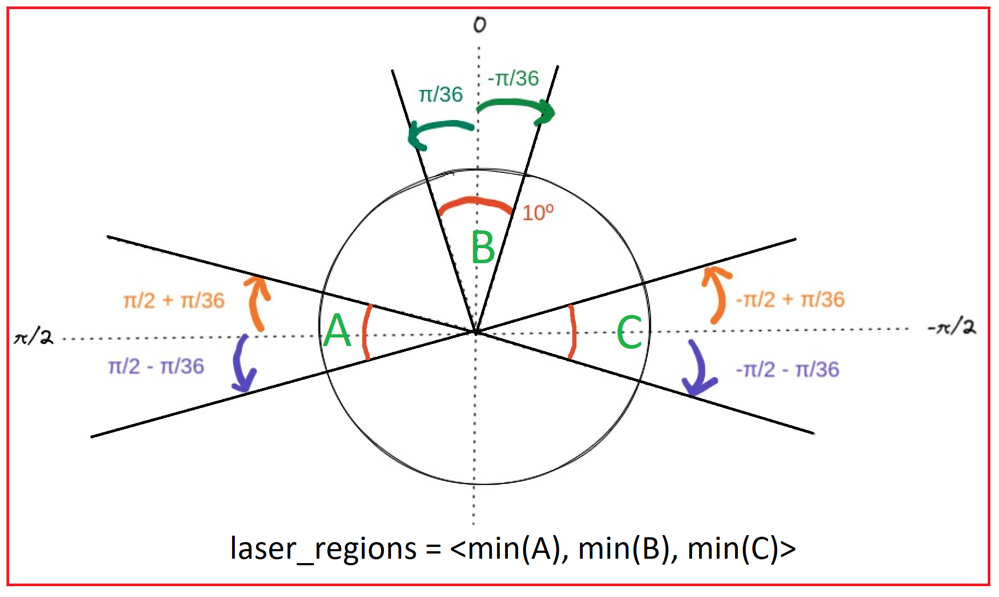
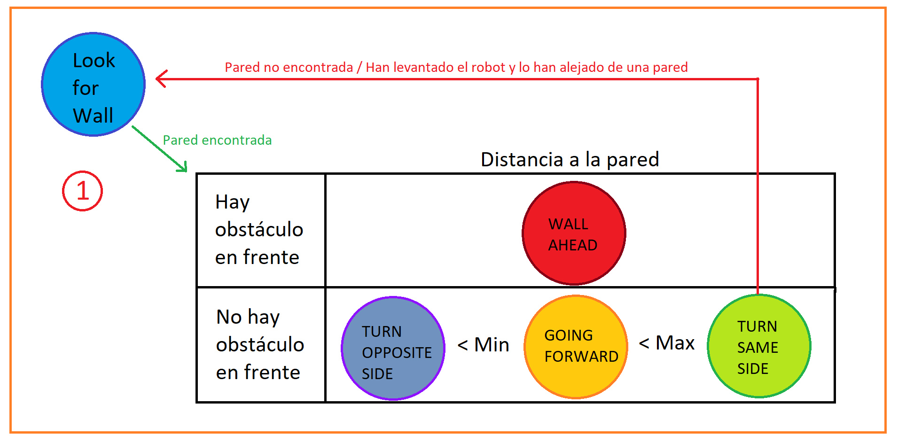

[](https://classroom.github.com/online_ide?assignment_repo_id=6883151&assignment_repo_type=AssignmentRepo)

[](https://github.com/Docencia-fmrico/follow-wall-k-bots)


# folllow_wall

## Extracción valores del láser
Para saber donde están los obstáculos, en este caso la pared, usamos el laser. Como procesado, extraemos la medida mínima en un cono de amplitud de 10º centrado en tres regiones: la frontal (0), la izquierda (pi/2) y la derecha (-pi/2). Finalmente, las tres medidas se guardan en un vector.   
<p align="center">

</p align>

## Control de Movimiento
Aprovechando las características de los LifeCycle Nodes y sus estados y transiciones, usamos la transición on_configure() para ver si el robot tiene algún obstáculo cercano a izquierda o derecha y comenzar siguiendo ese lado del robot directamente. Si no hay nada cerca, se elige un lado del robot para seguir la pared al azar.
```
FollowWallNode::on_configure() {
  // Esperar por medidas del laser
  while (laser_regions.size() == 0) {continue;}
  
  // Elegir un lado a seguir
  if (laser_regions[A] < distance) {side = LEFT;}
  else if (laser_regions[C] < distance) {side = RIGHT;}
  else {
    if (rand() % 2 == 0) {side = LEFT;}
    else {side = RIGHT;}
  }
}
```
Una vez se ha realizado la configuración, se espera a que el nodo sea activado para comenzar a mover el robot. Si se desease cambiar la configuración de que lado sigue el robot, basta con volver a ejecutar la transición on_configure().

Cuando se active el nodo se realizará el siguiente proceso de comprobación. Una vez hecho, en función del estado seleccionado se seleccionarán velocidades lineales y angulares correspondientes a cada estado:
<p align="center">

</p align>
En el caso de que se aleje al robot de la pared, este comenzará a girar hacía el lado que estaba siguiendo. Se ha contemplado que si ha entrado en dicho estado, un número concreto de iteraciones, el robot deje hacer este movimiento y vuelva a buscar la pared avanzando hacia una dirección hasta volver a encontrarla.

